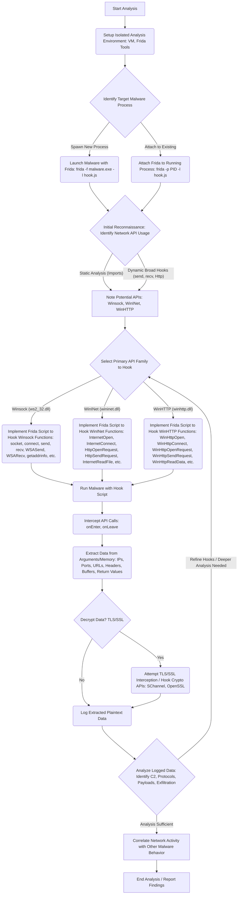

# Using Frida for Dynamic Analysis of Malware Network Communications

## 1. Introduction

Analyzing the network communications of malware is a critical aspect of understanding its behavior, command-and-control (C2) infrastructure, data exfiltration techniques, and overall threat potential. However, modern malware often employs sophisticated methods to obscure its network activity, including encryption (TLS/SSL), custom protocols, and dynamic API resolution, making traditional network sniffing tools like Wireshark less effective on their own. Static analysis can reveal potential network functions, but dynamic analysis is essential to observe the actual runtime behavior and data exchanged.

This is where dynamic instrumentation toolkits like Frida become invaluable. Frida allows security researchers and reverse engineers to inject custom JavaScript code into running processes, enabling them to hook functions, inspect memory, modify behavior, and intercept data in real-time, directly within the context of the malware process itself. This capability provides unparalleled visibility into the malware's internal operations, including its network interactions before encryption or after decryption.

This article provides a highly technical guide on leveraging Frida for the dynamic analysis of malware network communications on the Windows platform. We will explore the fundamentals of Frida, delve into the relevant Windows networking APIs (Winsock, WinINet, WinHTTP), present a methodology for hooking these APIs effectively, provide detailed code examples, and discuss advanced techniques for handling encryption and evasion. The objective is to equip analysts with the knowledge and practical skills to use Frida to dissect and understand even complex malware network behavior.

## 2. Understanding Frida for Malware Analysis

### What is Frida?

Frida describes itself as a 

"dynamic instrumentation toolkit". At its core, Frida allows you to inject snippets of JavaScript (or your own compiled library) into native apps on various platforms, including Windows. This injected code runs within the target process's memory space, granting it intimate access to the application's state and behavior.

Frida achieves this through a client-server architecture. The Frida client (often a Python script or the Frida command-line tools) runs on your analysis machine and communicates with a Frida server injected into the target process. This server hosts a JavaScript runtime (QuickJS) where your instrumentation scripts are executed. These scripts can interact with the Frida core (written in C) to perform actions like:

*   **Function Hooking:** Intercept calls to specific functions (like Windows APIs or internal malware functions), inspect or modify arguments, change the return value, or even prevent the original function from executing.
*   **Memory Access:** Read and write to the target process's memory, allowing inspection of data structures, strings, and buffers.
*   **Native Function Calling:** Call native functions within the target process directly from your JavaScript script.
*   **Dynamic Code Execution:** Execute arbitrary code within the target process.

### Key Features Relevant to Malware Analysis

Frida offers several features that make it exceptionally well-suited for dynamic malware analysis:

*   **Powerful Hooking Engine:** Frida's `Interceptor` API provides a robust way to hook functions at specific addresses or by name (using `Module.findExportByName` or `DebugSymbol.fromName`). It allows defining `onEnter` and `onLeave` handlers to execute JavaScript code before and after the original function runs.
*   **JavaScript Scripting:** Using JavaScript makes writing instrumentation scripts relatively quick and easy. Frida provides a rich JavaScript API for interacting with the target process, including memory manipulation (`Memory.read*`, `Memory.write*`), native function calls (`NativeFunction`), and thread management.
*   **Cross-Platform:** While this article focuses on Windows, Frida supports numerous platforms (macOS, Linux, iOS, Android), making the core concepts transferable.
*   **Introspection Capabilities:** Frida allows enumerating loaded modules, exports, imports, and memory ranges within the target process, aiding in understanding the malware's structure and identifying potential hooking targets.
*   **Bi-directional Communication:** Scripts running inside the target process can send messages back to the controlling application (e.g., your Python script) using `send()`, allowing extracted data (like network buffers or decrypted strings) to be logged and analyzed externally.

### Setting up a Frida Environment for Malware Analysis

Setting up a safe and effective environment is crucial before analyzing malware with Frida.

1.  **Isolated Environment:** **Never run malware directly on your host machine.** Always use an isolated virtual machine (VM) specifically configured for malware analysis. Tools like VMware Workstation/Fusion, VirtualBox, or Hyper-V are suitable. Ensure the VM has network access disabled or strictly controlled (e.g., through a dedicated virtual network or a proxy configured for monitoring) to prevent the malware from communicating externally unless intended during analysis.
2.  **Snapshotting:** Take a clean snapshot of your analysis VM before running any malware. This allows you to easily revert the system to a known-good state after each analysis session.
3.  **Frida Installation:** Frida consists of tools (command-line utilities) and bindings (for Python, Node.js, etc.). The easiest way to get started is by installing the Python tools:
    ```bash
    pip install frida-tools
    ```
    This installs `frida`, `frida-trace`, `frida-ps`, etc. You will also need the corresponding Frida server executable for the target architecture (e.g., `frida-server-XX.Y.Z-windows-x86_64.exe`) placed on the analysis VM if you plan to use Frida in injected mode without spawning the process directly.
4.  **Python Environment:** Ensure you have a working Python 3 installation on your analysis host (or within the VM if you prefer running everything there) to write and run your Frida control scripts.
5.  **Dependencies:** Depending on your analysis goals, you might need additional tools like Wireshark/tcpdump (for correlating Frida's findings with raw network traffic), text editors, disassemblers (IDA Pro, Ghidra), and debuggers.

**Safety First:** Remember that you are dealing with malicious code. Treat your analysis environment with extreme caution. Disable shared folders, limit network connectivity, and always revert to a clean snapshot after analysis.


## 3. Windows Network API Landscape

Before diving into hooking, it's essential to understand the primary Windows APIs that malware commonly uses for network communication. Different APIs offer varying levels of abstraction and functionality, and malware authors choose them based on their needs for stealth, control, and protocol support.

*   **Winsock (Windows Sockets API - `ws2_32.dll`):** This is the foundational networking API in Windows, providing low-level access to network protocols like TCP and UDP. It's based on the Berkeley sockets standard. Malware often uses Winsock for:
    *   Implementing custom C2 communication protocols.
    *   Direct TCP/UDP connections for data transfer or scanning.
    *   DNS lookups via functions like `getaddrinfo` or the older `gethostbyname`.
    *   **Key Functions:** `WSAStartup`, `socket`, `WSASocketW`, `bind`, `listen`, `accept`, `connect`, `WSAConnect`, `send`, `WSASend`, `recv`, `WSARecv`, `closesocket`, `getaddrinfo`, `GetAddrInfoW`.

*   **WinINet (Windows Internet API - `wininet.dll`):** A higher-level API designed primarily for client applications accessing internet resources using standard protocols like HTTP, HTTPS, and FTP. It handles many protocol details automatically.
    *   Often used by malware for simpler HTTP/HTTPS C2 communication, downloading payloads, or exfiltrating data via web requests.
    *   It integrates with Internet Explorer settings (proxies, cookies).
    *   **Key Functions:** `InternetOpenW`, `InternetConnectW`, `HttpOpenRequestW`, `HttpSendRequestW`, `HttpAddRequestHeadersW`, `InternetReadFile`, `InternetWriteFile`, `InternetCloseHandle`.

*   **WinHTTP (Windows HTTP Services - `winhttp.dll`):** Another high-level API focused specifically on HTTP/HTTPS communication. It's generally considered more suitable for server applications, services, or scenarios requiring more control than WinINet. It does not rely on IE settings.
    *   Used by malware for robust HTTP/HTTPS C2, especially in scenarios where WinINet might be blocked or monitored differently.
    *   **Key Functions:** `WinHttpOpen`, `WinHttpConnect`, `WinHttpOpenRequest`, `WinHttpSendRequest`, `WinHttpWriteData`, `WinHttpReceiveResponse`, `WinHttpQueryHeaders`, `WinHttpReadData`, `WinHttpCloseHandle`.

Understanding which API family the malware utilizes (often determined through static analysis of imports or initial dynamic tracing) is crucial for selecting the correct functions to hook with Frida.

## 4. Frida Hooking Methodology for Network Analysis

Intercepting network communications with Frida involves a systematic process of identifying target functions, implementing hooks, extracting relevant data, and analyzing the results. The following methodology, visually represented in the flowchart below, provides a structured approach:




**Flowchart Description:**

This flowchart outlines the methodology for using Frida to intercept and analyze network communications from malware running on Windows.

1.  **Start & Setup:** Begin by setting up a secure, isolated virtual machine environment with Frida and necessary analysis tools installed.
2.  **Target Identification & Frida Injection:** Identify the target malware process. Either launch the malware directly with Frida attached (`-f` flag) or attach Frida to an already running malware process (`-p` flag), loading the initial hook script.
3.  **API Reconnaissance:** Perform initial reconnaissance to determine which network API families the malware likely uses. This can involve static analysis (checking imported DLLs like `ws2_32.dll`, `wininet.dll`, `winhttp.dll`) or using broad Frida hooks initially (e.g., tracing all functions containing `send` or `Http`).
4.  **Hook Implementation:** Based on the reconnaissance, select the primary API family (Winsock, WinINet, or WinHTTP) and implement a specific Frida JavaScript hook script targeting key functions within that family responsible for connection establishment, data transmission, and potentially DNS resolution.
5.  **Execution & Interception:** Run the malware with the specific hook script loaded.
6.  **Data Extraction:** Within the Frida script's `onEnter` and `onLeave` handlers for the hooked functions, intercept the function calls and extract relevant data from arguments (like buffers, URLs, IP addresses, ports) and memory pointers. Also, capture return values.
7.  **Decryption (If Necessary):** If the traffic appears to be encrypted (e.g., HTTPS), attempt TLS/SSL interception. This might involve hooking lower-level TLS/SSL library functions (like SChannel on Windows or potentially linked OpenSSL functions) to capture plaintext data before encryption or after decryption.
8.  **Logging:** Log the extracted (and potentially decrypted) network data (IPs, ports, URLs, headers, request/response bodies) in a structured format.
9.  **Analysis & Iteration:** Analyze the logged data to understand the malware's network behavior, identify command-and-control (C2) servers, communication protocols, data exfiltration patterns, etc. If needed, refine the Frida hooks (e.g., hook additional functions, improve data parsing) and repeat the process.
10. **Correlation & Conclusion:** Once sufficient network data is gathered, correlate it with other observed malware behaviors (file system activity, registry changes) and conclude the analysis, documenting the findings.

**1. Identify Target Functions:**
   *   **Static Analysis:** Examine the malware's import table using tools like PE-bear, CFF Explorer, or disassemblers (IDA Pro, Ghidra). Look for imports from `ws2_32.dll`, `wininet.dll`, or `winhttp.dll`.
   *   **Dynamic Tracing:** Use `frida-trace` with broad patterns to observe API calls during runtime. For example:
     ```bash
     # Trace common send/receive functions
     frida-trace -i "*send*" -i "*recv*" -f malware.exe
     # Trace common HTTP functions
     frida-trace -i "HttpSendRequest*" -i "InternetReadFile*" -i "WinHttpSendRequest*" -f malware.exe
     # Trace socket connection functions
     frida-trace -i "*connect" -f malware.exe 
     ```
   *   Focus on functions related to socket creation, connection establishment, data transmission/reception, and potentially DNS resolution or HTTP request handling.

**2. Design Effective Hooks:**
   *   **Core Mechanism:** Use `Interceptor.attach(targetAddress, callbacks)`. The `targetAddress` is obtained using `Module.findExportByName("dll_name", "function_name")` or `DebugSymbol.fromName("function_name").address`.
   *   **Callbacks (`onEnter`, `onLeave`):**
     *   `onEnter(args)`: Executes *before* the original function. `args` is an array of `NativePointer` objects representing the function arguments. Use this to read or modify input parameters.
     *   `onLeave(retval)`: Executes *after* the original function returns. `retval` is a `NativePointer` representing the return value. Use this to read or modify the return value, or to access output parameters populated by the function (often pointers passed in `args`).
   *   **Accessing Data:** Use Frida's JavaScript API to interpret the `NativePointer` objects in `args` and `retval` based on the function's signature:
     *   `ptr.readPointer()`: Read a pointer value.
     *   `ptr.readUtf8String()`, `ptr.readUtf16String()`: Read null-terminated strings.
     *   `ptr.readByteArray(length)`: Read raw bytes into an ArrayBuffer.
     *   `ptr.toInt32()`, `ptr.readU32()`, etc.: Read integer values.
     *   `Memory.read*`: Read data from an arbitrary memory address (e.g., reading the contents of a buffer pointed to by an argument).
   *   **State Management:** Use `this` within the callback object to share state between `onEnter` and `onLeave` for a single function invocation (e.g., saving a buffer pointer in `onEnter` to read its contents in `onLeave` after the function fills it).

**3. Capture and Analyze Network Data:**
   *   **Data Extraction:** Inside the hooks, extract key information: IP addresses, port numbers, URLs, HTTP headers, request/response bodies (buffers), protocol flags, lengths, etc.
   *   **Logging:**
     *   `console.log()`: Useful for quick debugging and observing calls directly in the Frida console.
     *   `send(jsonData)`: Send structured data (e.g., JSON objects containing extracted information) back to your controlling Python script for more robust logging, parsing, and storage. This is the preferred method for systematic analysis.
   *   **Buffer Handling:** Use `hexdump(ptr, { length: len })` or `Memory.readByteArray` to inspect buffer contents. Be mindful of buffer lengths provided in other arguments or return values.

**4. Handle Encrypted Communications (Initial Consideration):**
   *   Recognize that hooking functions like `send`/`recv` or `InternetReadFile`/`WinHttpReadData` might yield encrypted data if TLS/SSL is used.
   *   The strategy often involves hooking *before* encryption or *after* decryption. This could mean:
     *   Hooking higher-level functions (e.g., `HttpSendRequest` in WinINet/WinHTTP often takes plaintext data before TLS). 
     *   Hooking cryptographic API functions (e.g., from Windows SChannel, or potentially linked libraries like OpenSSL) used by the malware. (Detailed in Advanced Techniques section).

**5. Evade Anti-Analysis (Initial Consideration):**
   *   Be aware that malware might employ techniques to detect Frida or debugger presence.
   *   Frida itself has some anti-anti-debugging capabilities, but advanced malware might require more sophisticated bypass techniques (covered later). Start with simple hooks and observe if the malware behaves differently or crashes.

## 5. Hooking Winsock APIs

Winsock (Windows Sockets API) is the foundational networking API in Windows, providing low-level access to TCP/IP and other network protocols. Malware often uses Winsock for custom communication protocols, direct TCP/UDP connections, and DNS resolution. Let's explore how to effectively hook these functions with Frida.

### Understanding the Winsock API Flow

A typical Winsock communication flow in malware follows these steps:

1. **Initialization**: Call `WSAStartup` to initialize the Winsock library
2. **Socket Creation**: Create a socket using `socket` or `WSASocket`
3. **Name Resolution**: Resolve domain names to IP addresses using `getaddrinfo` or similar
4. **Connection**: Connect to a remote server using `connect` or `WSAConnect`
5. **Data Transmission**: Send data using `send`, `WSASend`, or similar functions
6. **Data Reception**: Receive data using `recv`, `WSARecv`, or similar functions
7. **Cleanup**: Close sockets with `closesocket` and clean up with `WSACleanup`

### Comprehensive Winsock Hooking Script

Below is a complete Frida script for hooking key Winsock functions to intercept network communications:

```javascript
// winsock_hook.js - Comprehensive Winsock API hooking script for malware analysis
// Usage: frida -f malware.exe -l winsock_hook.js

// Global storage for socket information
const sockets = {};

// Utility function to format buffer data
function formatBuffer(arrayBuffer, maxLength = 100) {
    const bytes = new Uint8Array(arrayBuffer);
    let hex = '';
    let ascii = '';
    let truncated = false;
    
    const length = Math.min(bytes.length, maxLength);
    if (bytes.length > maxLength) truncated = true;
    
    for (let i = 0; i < length; i++) {
        const byte = bytes[i];
        // Add hex representation
        hex += ('0' + byte.toString(16)).slice(-2) + ' ';
        // Add ASCII representation (printable chars only)
        ascii += (byte >= 32 && byte <= 126) ? String.fromCharCode(byte) : '.';
    }
    
    return {
        hex: hex.trim(),
        ascii: ascii,
        truncated: truncated,
        fullLength: bytes.length
    };
}

// Utility function to convert sockaddr structure to string representation
function sockaddrToString(sockaddrPtr) {
    try {
        // Read the address family (first 2 bytes)
        const family = Memory.readU16(sockaddrPtr);
        
        // Handle IPv4 (AF_INET = 2)
        if (family === 2) {
            // sockaddr_in structure:
            // struct sockaddr_in {
            //     short          sin_family;    // 2 bytes: Address family (AF_INET)
            //     unsigned short sin_port;      // 2 bytes: Port in network byte order
            //     struct in_addr sin_addr;      // 4 bytes: IPv4 address
            //     char           sin_zero[8];   // 8 bytes: Padding
            // };
            
            const port = Memory.readU16(sockaddrPtr.add(2));
            const portNumber = ((port & 0xFF) << 8) | ((port & 0xFF00) >> 8); // Convert from network byte order
            
            const ipBytes = Memory.readByteArray(sockaddrPtr.add(4), 4);
            const ipArray = new Uint8Array(ipBytes);
            const ipAddress = ipArray[0] + '.' + ipArray[1] + '.' + ipArray[2] + '.' + ipArray[3];
            
            return `IPv4: ${ipAddress}:${portNumber}`;
        }
        // Handle IPv6 (AF_INET6 = 23 on Windows)
        else if (family === 23) {
            // sockaddr_in6 structure is more complex, simplified here
            const port = Memory.readU16(sockaddrPtr.add(2));
            const portNumber = ((port & 0xFF) << 8) | ((port & 0xFF00) >> 8);
            
            // Read the 16-byte IPv6 address
            const ipBytes = Memory.readByteArray(sockaddrPtr.add(8), 16);
            const ipArray = new Uint8Array(ipBytes);
            
            // Format IPv6 address
            let ipAddress = '';
            for (let i = 0; i < 16; i += 2) {
                ipAddress += (ipArray[i] * 256 + ipArray[i+1]).toString(16) + ':';
            }
            ipAddress = ipAddress.slice(0, -1); // Remove trailing colon
            
            return `IPv6: [${ipAddress}]:${portNumber}`;
        }
        else {
            return `Unknown address family: ${family}`;
        }
    } catch (e) {
        return `Error parsing sockaddr: ${e.message}`;
    }
}

// Hook WSAStartup - Initialization of Winsock
Interceptor.attach(Module.findExportByName('ws2_32.dll', 'WSAStartup'), {
    onEnter(args) {
        this.wVersionRequested = args[0].toInt32();
        console.log(`[+] WSAStartup called with version ${(this.wVersionRequested & 0xFF).toString(16)}.${((this.wVersionRequested >> 8) & 0xFF).toString(16)}`);
    },
    onLeave(retval) {
        console.log(`[+] WSAStartup returned: ${retval.toInt32()} (0 = success)`);
    }
});

// Hook socket/WSASocket - Socket creation
Interceptor.attach(Module.findExportByName('ws2_32.dll', 'socket'), {
    onEnter(args) {
        this.af = args[0].toInt32();      // Address family
        this.type = args[1].toInt32();    // Socket type
        this.protocol = args[2].toInt32(); // Protocol
        
        // Map address family to string
        const afMap = {
            2: 'AF_INET (IPv4)',
            23: 'AF_INET6 (IPv6)',
            6: 'AF_IPX',
            16: 'AF_APPLETALK',
            17: 'AF_NETBIOS',
            32: 'AF_IRDA',
            26: 'AF_BLUETOOTH'
        };
        
        // Map socket type to string
        const typeMap = {
            1: 'SOCK_STREAM (TCP)',
            2: 'SOCK_DGRAM (UDP)',
            3: 'SOCK_RAW',
            4: 'SOCK_RDM',
            5: 'SOCK_SEQPACKET'
        };
        
        // Map protocol to string
        const protocolMap = {
            0: 'IPPROTO_IP (default)',
            1: 'IPPROTO_ICMP',
            6: 'IPPROTO_TCP',
            17: 'IPPROTO_UDP'
        };
        
        console.log(`[+] socket called: family=${afMap[this.af] || this.af}, type=${typeMap[this.type] || this.type}, protocol=${protocolMap[this.protocol] || this.protocol}`);
    },
    onLeave(retval) {
        const socketId = retval.toInt32();
        if (socketId !== -1) {
            console.log(`[+] socket created: ${socketId}`);
            // Store socket info for later reference
            sockets[socketId] = {
                'created': new Date().toISOString(),
                'family': this.af,
                'type': this.type,
                'protocol': this.protocol,
                'connected': false,
                'remoteAddress': null,
                'bytesSent': 0,
                'bytesReceived': 0
            };
        } else {
            console.log(`[!] socket creation failed`);
        }
    }
});

// Hook WSASocket (more advanced socket creation)
Interceptor.attach(Module.findExportByName('ws2_32.dll', 'WSASocketW') || 
                  Module.findExportByName('ws2_32.dll', 'WSASocketA'), {
    onEnter(args) {
        this.af = args[0].toInt32();      // Address family
        this.type = args[1].toInt32();    // Socket type
        this.protocol = args[2].toInt32(); // Protocol
        console.log(`[+] WSASocket called: family=${this.af}, type=${this.type}, protocol=${this.protocol}`);
    },
    onLeave(retval) {
        const socketId = retval.toInt32();
        if (socketId !== -1) {
            console.log(`[+] WSASocket created: ${socketId}`);
            sockets[socketId] = {
                'created': new Date().toISOString(),
                'family': this.af,
                'type': this.type,
                'protocol': this.protocol,
                'connected': false,
                'remoteAddress': null,
                'bytesSent': 0,
                'bytesReceived': 0
            };
        } else {
            console.log(`[!] WSASocket creation failed`);
        }
    }
});

// Hook connect - Connection establishment
Interceptor.attach(Module.findExportByName('ws2_32.dll', 'connect'), {
    onEnter(args) {
        this.socketId = args[0].toInt32();
        this.sockaddrPtr = args[1];
        this.sockaddrLen = args[2].toInt32();
        
        const addressInfo = sockaddrToString(this.sockaddrPtr);
        console.log(`[+] connect called: socket=${this.socketId}, address=${addressInfo}`);
        
        // Store connection info
        if (sockets[this.socketId]) {
            sockets[this.socketId].connected = true;
            sockets[this.socketId].remoteAddress = addressInfo;
            sockets[this.socketId].connectTime = new Date().toISOString();
        }
        
        // Send detailed info to our controlling script
        send({
            type: 'connect',
            socketId: this.socketId,
            address: addressInfo,
            timestamp: new Date().toISOString()
        });
    },
    onLeave(retval) {
        const result = retval.toInt32();
        console.log(`[+] connect returned: ${result} (0 = success, otherwise error)`);
        
        // If connection failed, update our records
        if (result !== 0 && sockets[this.socketId]) {
            sockets[this.socketId].connected = false;
            sockets[this.socketId].connectionError = result;
        }
    }
});

// Hook WSAConnect (more advanced connection function)
Interceptor.attach(Module.findExportByName('ws2_32.dll', 'WSAConnect'), {
    onEnter(args) {
        this.socketId = args[0].toInt32();
        this.sockaddrPtr = args[1];
        
        const addressInfo = sockaddrToString(this.sockaddrPtr);
        console.log(`[+] WSAConnect called: socket=${this.socketId}, address=${addressInfo}`);
        
        if (sockets[this.socketId]) {
            sockets[this.socketId].connected = true;
            sockets[this.socketId].remoteAddress = addressInfo;
            sockets[this.socketId].connectTime = new Date().toISOString();
        }
        
        send({
            type: 'connect',
            socketId: this.socketId,
            address: addressInfo,
            function: 'WSAConnect',
            timestamp: new Date().toISOString()
        });
    },
    onLeave(retval) {
        const result = retval.toInt32();
        console.log(`[+] WSAConnect returned: ${result}`);
        
        if (result !== 0 && sockets[this.socketId]) {
            sockets[this.socketId].connected = false;
            sockets[this.socketId].connectionError = result;
        }
    }
});

// Hook send - Data transmission
Interceptor.attach(Module.findExportByName('ws2_32.dll', 'send'), {
    onEnter(args) {
        this.socketId = args[0].toInt32();
        this.bufferPtr = args[1];
        this.length = args[2].toInt32();
        this.flags = args[3].toInt32();
        
        // Read the buffer content
        if (this.length > 0) {
            try {
                const buffer = Memory.readByteArray(this.bufferPtr, this.length);
                const formatted = formatBuffer(buffer);
                
                console.log(`[+] send called: socket=${this.socketId}, length=${this.length}, flags=${this.flags}`);
                console.log(`    Data: ${formatted.ascii.substring(0, 50)}${formatted.truncated ? '...' : ''}`);
                
                // Update socket stats
                if (sockets[this.socketId]) {
                    sockets[this.socketId].bytesSent += this.length;
                    sockets[this.socketId].lastSendTime = new Date().toISOString();
                }
                
                // Send the full data to our controlling script
                send({
                    type: 'send',
                    socketId: this.socketId,
                    length: this.length,
                    flags: this.flags,
                    data: Array.from(new Uint8Array(buffer)),  // Convert to array for serialization
                    hexData: formatted.hex,
                    asciiData: formatted.ascii,
                    timestamp: new Date().toISOString(),
                    remoteAddress: sockets[this.socketId] ? sockets[this.socketId].remoteAddress : null
                });
            } catch (e) {
                console.log(`[!] Error reading send buffer: ${e.message}`);
            }
        }
    },
    onLeave(retval) {
        const bytesSent = retval.toInt32();
        console.log(`[+] send returned: ${bytesSent} bytes sent`);
    }
});

// Hook WSASend - Advanced data transmission
Interceptor.attach(Module.findExportByName('ws2_32.dll', 'WSASend'), {
    onEnter(args) {
        this.socketId = args[0].toInt32();
        const bufferCount = args[2].toInt32();
        const bufferDescriptorPtr = args[1];
        this.flags = args[4].toInt32();
        
        console.log(`[+] WSASend called: socket=${this.socketId}, bufferCount=${bufferCount}, flags=${this.flags}`);
        
        // WSASend uses an array of WSABUF structures
        // typedef struct _WSABUF {
        //   ULONG len;   // 4 bytes
        //   CHAR  *buf;  // 4 or 8 bytes (pointer)
        // } WSABUF;
        
        const ptrSize = Process.pointerSize;
        const wsaBufSize = 4 + ptrSize;  // Size of WSABUF structure
        
        this.totalBytes = 0;
        
        // Process each buffer in the array
        for (let i = 0; i < bufferCount; i++) {
            const bufferStructPtr = bufferDescriptorPtr.add(i * wsaBufSize);
            const bufferLength = Memory.readUInt(bufferStructPtr);
            const bufferPtr = Memory.readPointer(bufferStructPtr.add(4));
            
            this.totalBytes += bufferLength;
            
            if (bufferLength > 0) {
                try {
                    const buffer = Memory.readByteArray(bufferPtr, bufferLength);
                    const formatted = formatBuffer(buffer);
                    
                    console.log(`    Buffer ${i}: length=${bufferLength}`);
                    console.log(`    Data: ${formatted.ascii.substring(0, 50)}${formatted.truncated ? '...' : ''}`);
                    
                    // Send buffer data to controlling script
                    send({
                        type: 'wsasend',
                        socketId: this.socketId,
                        bufferIndex: i,
                        length: bufferLength,
                        data: Array.from(new Uint8Array(buffer)),
                        hexData: formatted.hex,
                        asciiData: formatted.ascii,
                        timestamp: new Date().toISOString(),
                        remoteAddress: sockets[this.socketId] ? sockets[this.socketId].remoteAddress : null
                    });
                } catch (e) {
                    console.log(`[!] Error reading WSASend buffer ${i}: ${e.message}`);
                }
            }
        }
        
        // Update socket stats
        if (sockets[this.socketId]) {
            sockets[this.socketId].bytesSent += this.totalBytes;
            sockets[this.socketId].lastSendTime = new Date().toISOString();
        }
    },
    onLeave(retval) {
        console.log(`[+] WSASend returned: ${retval.toInt32()}, total bytes queued: ${this.totalBytes}`);
    }
});

// Hook recv - Data reception
Interceptor.attach(Module.findExportByName('ws2_32.dll', 'recv'), {
    onEnter(args) {
        this.socketId = args[0].toInt32();
        this.bufferPtr = args[1];
        this.length = args[2].toInt32();
        this.flags = args[3].toInt32();
        
        console.log(`[+] recv called: socket=${this.socketId}, maxLength=${this.length}, flags=${this.flags}`);
    },
    onLeave(retval) {
        const bytesReceived = retval.toInt32();
        
        if (bytesReceived > 0) {
            try {
                const buffer = Memory.readByteArray(this.bufferPtr, bytesReceived);
                const formatted = formatBuffer(buffer);
                
                console.log(`[+] recv returned: ${bytesReceived} bytes received`);
                console.log(`    Data: ${formatted.ascii.substring(0, 50)}${formatted.truncated ? '...' : ''}`);
                
                // Update socket stats
                if (sockets[this.socketId]) {
                    sockets[this.socketId].bytesReceived += bytesReceived;
                    sockets[this.socketId].lastRecvTime = new Date().toISOString();
                }
                
                // Send the full data to our controlling script
                send({
                    type: 'recv',
                    socketId: this.socketId,
                    length: bytesReceived,
                    flags: this.flags,
                    data: Array.from(new Uint8Array(buffer)),
                    hexData: formatted.hex,
                    asciiData: formatted.ascii,
                    timestamp: new Date().toISOString(),
                    remoteAddress: sockets[this.socketId] ? sockets[this.socketId].remoteAddress : null
                });
            } catch (e) {
                console.log(`[!] Error reading recv buffer: ${e.message}`);
            }
        } else {
            console.log(`[+] recv returned: ${bytesReceived} (possible connection close or error)`);
        }
    }
});

// Hook WSARecv - Advanced data reception
Interceptor.attach(Module.findExportByName('ws2_32.dll', 'WSARecv'), {
    onEnter(args) {
        this.socketId = args[0].toInt32();
        const bufferCount = args[2].toInt32();
        const bufferDescriptorPtr = args[1];
        this.bytesReceivedPtr = args[3];
        this.flagsPtr = args[4];
        
        console.log(`[+] WSARecv called: socket=${this.socketId}, bufferCount=${bufferCount}`);
        
        // Store pointers for use in onLeave
        this.bufferDescriptorPtr = bufferDescriptorPtr;
        this.bufferCount = bufferCount;
    },
    onLeave(retval) {
        const result = retval.toInt32();
        
        if (result === 0) {
            const bytesReceived = Memory.readUInt(this.bytesReceivedPtr);
            console.log(`[+] WSARecv returned: ${bytesReceived} bytes received`);
            
            if (bytesReceived > 0) {
                const ptrSize = Process.pointerSize;
                const wsaBufSize = 4 + ptrSize;
                let bytesProcessed = 0;
                
                for (let i = 0; i < this.bufferCount && bytesProcessed < bytesReceived; i++) {
                    const bufferStructPtr = this.bufferDescriptorPtr.add(i * wsaBufSize);
                    const bufferLength = Memory.readUInt(bufferStructPtr);
                    const bufferPtr = Memory.readPointer(bufferStructPtr.add(4));
                    
                    const bytesToRead = Math.min(bufferLength, bytesReceived - bytesProcessed);
                    
                    if (bytesToRead > 0) {
                        try {
                            const buffer = Memory.readByteArray(bufferPtr, bytesToRead);
                            const formatted = formatBuffer(buffer);
                            
                            console.log(`    Buffer ${i}: length=${bytesToRead}`);
                            console.log(`    Data: ${formatted.ascii.substring(0, 50)}${formatted.truncated ? '...' : ''}`);
                            
                            // Send buffer data to controlling script
                            send({
                                type: 'wsarecv',
                                socketId: this.socketId,
                                bufferIndex: i,
                                length: bytesToRead,
                                data: Array.from(new Uint8Array(buffer)),
                                hexData: formatted.hex,
                                asciiData: formatted.ascii,
                                timestamp: new Date().toISOString(),
                                remoteAddress: sockets[this.socketId] ? sockets[this.socketId].remoteAddress : null
                            });
                            
                            bytesProcessed += bytesToRead;
                        } catch (e) {
                            console.log(`[!] Error reading WSARecv buffer ${i}: ${e.message}`);
                        }
                    }
                }
                
                // Update socket stats
                if (sockets[this.socketId]) {
                    sockets[this.socketId].bytesReceived += bytesReceived;
                    sockets[this.socketId].lastRecvTime = new Date().toISOString();
                }
            }
        } else {
            console.log(`[!] WSARecv failed with error code: ${result}`);
        }
    }
});

// Hook closesocket - Socket closure
Interceptor.attach(Module.findExportByName('ws2_32.dll', 'closesocket'), {
    onEnter(args) {
        this.socketId = args[0].toInt32();
        console.log(`[+] closesocket called: socket=${this.socketId}`);
        
        // Log final stats before closing
        if (sockets[this.socketId]) {
            const info = sockets[this.socketId];
            console.log(`    Socket Info: Remote=${info.remoteAddress}, Sent=${info.bytesSent}, Received=${info.bytesReceived}`);
            
            send({
                type: 'close_socket',
                socketId: this.socketId,
                socketInfo: info,
                timestamp: new Date().toISOString()
            });
        }
    },
    onLeave(retval) {
        console.log(`[+] closesocket returned: ${retval.toInt32()}`);
        // Remove socket from our tracking
        if (sockets[this.socketId]) {
            delete sockets[this.socketId];
        }
    }
});

// Hook getaddrinfo/GetAddrInfoW - DNS Resolution
Interceptor.attach(Module.findExportByName('ws2_32.dll', 'GetAddrInfoW') || 
                  Module.findExportByName('ws2_32.dll', 'getaddrinfo'), {
    onEnter(args) {
        this.nodeNamePtr = args[0];
        this.serviceNamePtr = args[1];
        this.hintsPtr = args[2];
        this.resultPtr = args[3];
        
        if (this.nodeNamePtr !== null) {
            try {
                this.nodeName = this.nodeNamePtr.readUtf16String(); // Assuming GetAddrInfoW
                console.log(`[+] GetAddrInfoW called for hostname: ${this.nodeName}`);
                
                send({
                    type: 'dns_resolution',
                    hostname: this.nodeName,
                    timestamp: new Date().toISOString()
                });
            } catch (e) {
                console.log(`[!] Error reading hostname in GetAddrInfoW: ${e.message}`);
            }
        }
    },
    onLeave(retval) {
        const result = retval.toInt32();
        console.log(`[+] GetAddrInfoW returned: ${result} (0 = success)`);
        
        // Optionally, parse the addrinfo structure pointed to by *resultPtr
        // This is complex and requires careful parsing of linked lists and structures
        // For simplicity, we focus on capturing the hostname being resolved
    }
});

console.log("[*] Winsock API hooks installed. Monitoring network activity...");
```

### Python Controller Script for Winsock

To effectively use the Frida script, you need a Python script to launch Frida, inject the script, and receive the messages sent back via `send()`.

```python
#!/usr/bin/env python3
# winsock_controller.py - Controller script for Winsock Frida hooks

import frida
import sys
import json
import time
import os
from datetime import datetime

# Directory to save captured data
OUTPUT_DIR = "winsock_capture"

# Create output directory if it doesn't exist
os.makedirs(OUTPUT_DIR, exist_ok=True)

# Log files
conn_log = open(os.path.join(OUTPUT_DIR, "connections.log"), "w")
data_log = open(os.path.join(OUTPUT_DIR, "data.log"), "w")
dns_log = open(os.path.join(OUTPUT_DIR, "dns.log"), "w")
debug_log = open(os.path.join(OUTPUT_DIR, "debug.log"), "w")

def on_message(message, data):
    """Callback function to handle messages from the Frida script"""
    if message['type'] == 'send':
        payload = message['payload']
        
        # Log raw message for debugging
        debug_log.write(f"[{datetime.now().isoformat()}] {json.dumps(payload)}\n")
        debug_log.flush()
        
        # Process different message types
        if 'type' in payload:
            msg_type = payload['type']
            timestamp = payload.get('timestamp', datetime.now().isoformat())
            
            # Connection event
            if msg_type == 'connect':
                socket_id = payload['socketId']
                address = payload['address']
                conn_log.write(f"[{timestamp}] CONNECT: Socket {socket_id} to {address}\n")
                conn_log.flush()
                print(f"[+] Connection detected: {address}")
            
            # Data transfer event (send/recv)
            elif msg_type in ['send', 'wsasend', 'recv', 'wsarecv']:
                socket_id = payload['socketId']
                remote_addr = payload.get('remoteAddress', 'unknown')
                length = payload['length']
                direction = 'outbound' if msg_type in ['send', 'wsasend'] else 'inbound'
                
                # Log basic info
                data_log.write(f"[{timestamp}] {'SEND' if direction == 'outbound' else 'RECV'}: Socket {socket_id} {'to' if direction == 'outbound' else 'from'} {remote_addr}, {length} bytes\n")
                
                # Save the raw data
                if 'data' in payload:
                    # Save to file
                    data_filename = os.path.join(OUTPUT_DIR, f"{'send' if direction == 'outbound' else 'recv'}_{socket_id}_{int(time.time())}.bin")
                    with open(data_filename, "wb") as f:
                        f.write(bytes(payload['data']))
                    data_log.write(f"    Data saved to: {data_filename}\n")
                    
                    # Also log ASCII representation if available
                    if 'asciiData' in payload:
                        data_log.write(f"    ASCII: {payload['asciiData'][:100]}" + 
                                          ("..." if len(payload['asciiData']) > 100 else "") + "\n")
                
                data_log.flush()
            
            # DNS resolution event
            elif msg_type == 'dns_resolution':
                hostname = payload['hostname']
                dns_log.write(f"[{timestamp}] DNS QUERY: {hostname}\n")
                dns_log.flush()
                print(f"[+] DNS resolution: {hostname}")
            
            # Socket close event
            elif msg_type == 'close_socket':
                socket_id = payload['socketId']
                info = payload.get('socketInfo', {})
                conn_log.write(f"[{timestamp}] CLOSE: Socket {socket_id}\n")
                conn_log.write(f"    Info: Remote={info.get('remoteAddress', 'N/A')}, Sent={info.get('bytesSent', 0)}, Received={info.get('bytesReceived', 0)}\n")
                conn_log.flush()
                print(f"[+] Socket closed: {socket_id}")
                
    elif message['type'] == 'error':
        print(f"[!] Error: {message['stack']}")
        debug_log.write(f"[{datetime.now().isoformat()}] ERROR: {message['stack']}\n")
        debug_log.flush()

def main(target_process):
    try:
        # Load the Frida script
        with open("winsock_hook.js", "r") as f:
            script_code = f.read()
        
        # Determine if target is a PID or process name
        try:
            pid = int(target_process)
            print(f"[*] Attaching to process with PID {pid}...")
            session = frida.attach(pid)
        except ValueError:
            print(f"[*] Spawning process {target_process}...")
            pid = frida.spawn(target_process)
            session = frida.attach(pid)
            frida.resume(pid)
        
        # Create and load script
        print("[*] Creating script...")
        script = session.create_script(script_code)
        script.on('message', on_message)
        
        print("[*] Loading script...")
        script.load()
        
        print(f"[*] Analysis started. Monitoring PID: {pid}")
        print(f"[*] Output directory: {OUTPUT_DIR}")
        print("[*] Press Ctrl+C to stop.")
        
        # Keep the script running
        sys.stdin.read()
        
    except KeyboardInterrupt:
        print("[*] Stopping analysis...")
    except Exception as e:
        print(f"[!] Error: {str(e)}")
    finally:
        # Close log files
        conn_log.close()
        data_log.close()
        dns_log.close()
        debug_log.close()
        print(f"[*] Analysis complete. Results saved to {OUTPUT_DIR}/")

if __name__ == '__main__':
    if len(sys.argv) != 2:
        print(f"Usage: python {sys.argv[0]} <process_name_or_pid>")
        sys.exit(1)
    
    target = sys.argv[1]
    main(target)
```

### Analysis of Captured Data

The Python controller script logs the captured data into separate files:

*   `connections.log`: Records connection attempts and socket closures.
*   `data.log`: Logs data sent and received, including ASCII previews.
*   `dns.log`: Records hostnames being resolved via `GetAddrInfoW`.
*   `debug.log`: Contains raw JSON messages from the Frida script for debugging.
*   Raw data buffers are saved as `.bin` files in the `winsock_capture` directory.

This structured logging allows analysts to reconstruct the network communication flow, examine the content of data transfers (potentially requiring further parsing or decryption depending on the protocol), and identify C2 servers or other network endpoints contacted by the malware.


## 6. Hooking HTTP-related APIs

While Winsock provides low-level network access, many malware samples use higher-level HTTP APIs for communication, particularly for web-based command and control (C2) channels. Windows provides two main HTTP API families: WinINet and WinHTTP. Let's explore how to hook these APIs to intercept HTTP traffic.

### WinINet API Hooking

WinINet is commonly used by malware for HTTP/HTTPS communications because it's relatively easy to use and handles many protocol details automatically. It's also the API used by Internet Explorer, so it integrates with IE's settings for proxies, cookies, and authentication.

Here's a comprehensive Frida script for hooking key WinINet functions:

```javascript
// wininet_hook.js - WinINet API hooking script for malware analysis
// Usage: frida -f malware.exe -l wininet_hook.js

// Track Internet handles for correlation
const internetHandles = {};
const requestHandles = {};

// Utility function to format buffer data
function formatBuffer(arrayBuffer, maxLength = 100) {
    const bytes = new Uint8Array(arrayBuffer);
    let hex = '';
    let ascii = '';
    let truncated = false;
    
    const length = Math.min(bytes.length, maxLength);
    if (bytes.length > maxLength) truncated = true;
    
    for (let i = 0; i < length; i++) {
        const byte = bytes[i];
        hex += ('0' + byte.toString(16)).slice(-2) + ' ';
        ascii += (byte >= 32 && byte <= 126) ? String.fromCharCode(byte) : '.';
    }
    
    return {
        hex: hex.trim(),
        ascii: ascii,
        truncated: truncated,
        fullLength: bytes.length
    };
}

// Hook InternetOpenW - Initialize WinINet
Interceptor.attach(Module.findExportByName('wininet.dll', 'InternetOpenW'), {
    onEnter(args) {
        this.agentPtr = args[0];
        this.accessType = args[1].toInt32();
        
        // Read the user agent string
        if (this.agentPtr !== null) {
            try {
                this.userAgent = this.agentPtr.readUtf16String();
                console.log(`[+] InternetOpenW: UserAgent="${this.userAgent}"`);
            } catch (e) {
                console.log(`[!] Error reading user agent: ${e.message}`);
            }
        } else {
            this.userAgent = null;
            console.log(`[+] InternetOpenW: UserAgent=NULL (default)`);
        }
        
        // Map access type to string
        const accessTypeMap = {
            0: 'INTERNET_OPEN_TYPE_PRECONFIG (Default IE settings)',
            1: 'INTERNET_OPEN_TYPE_DIRECT (No proxy)',
            2: 'INTERNET_OPEN_TYPE_PROXY (Explicit proxy)',
            3: 'INTERNET_OPEN_TYPE_PRECONFIG_WITH_NO_AUTOPROXY'
        };
        
        console.log(`[+] InternetOpenW: AccessType=${accessTypeMap[this.accessType] || this.accessType}`);
        
        // Send to controlling script
        send({
            type: 'internet_open',
            userAgent: this.userAgent,
            accessType: this.accessType,
            accessTypeStr: accessTypeMap[this.accessType] || `Unknown (${this.accessType})`,
            timestamp: new Date().toISOString()
        });
    },
    onLeave(retval) {
        const handle = retval.toInt32();
        console.log(`[+] InternetOpenW returned handle: 0x${handle.toString(16)}`);
        
        if (handle !== 0) {
            // Store handle information
            internetHandles[handle] = {
                type: 'internet',
                userAgent: this.userAgent,
                accessType: this.accessType,
                created: new Date().toISOString(),
                connections: []
            };
        }
    }
});

// Hook InternetConnectW - Establish connection to server
Interceptor.attach(Module.findExportByName('wininet.dll', 'InternetConnectW'), {
    onEnter(args) {
        this.internetHandle = args[0].toInt32();
        this.serverNamePtr = args[1];
        this.serverPort = args[2].toInt32();
        this.usernamePtr = args[3];
        this.passwordPtr = args[4];
        this.service = args[5].toInt32();
        this.flags = args[6].toInt32();
        
        // Read server name
        if (this.serverNamePtr !== null) {
            try {
                this.serverName = this.serverNamePtr.readUtf16String();
            } catch (e) {
                this.serverName = "<error reading server name>";
            }
        } else {
            this.serverName = null;
        }
        
        // Read username and password if provided
        if (this.usernamePtr !== null) {
            try {
                this.username = this.usernamePtr.readUtf16String();
            } catch (e) {
                this.username = "<error reading username>";
            }
        } else {
            this.username = null;
        }
        
        if (this.passwordPtr !== null) {
            try {
                this.password = this.passwordPtr.readUtf16String();
            } catch (e) {
                this.password = "<error reading password>";
            }
        } else {
            this.password = null;
        }
        
        // Map service to string
        const serviceMap = {
            1: 'INTERNET_SERVICE_FTP',
            2: 'INTERNET_SERVICE_GOPHER',
            3: 'INTERNET_SERVICE_HTTP'
        };
        
        console.log(`[+] InternetConnectW: Server=${this.serverName}, Port=${this.serverPort}, Service=${serviceMap[this.service] || this.service}`);
        
        if (this.username) {
            console.log(`[+] Authentication: Username=${this.username}, Password=${this.password ? '*'.repeat(this.password.length) : 'NULL'}`);
        }
        
        // Send to controlling script
        send({
            type: 'internet_connect',
            internetHandle: this.internetHandle,
            server: this.serverName,
            port: this.serverPort,
            service: this.service,
            serviceStr: serviceMap[this.service] || `Unknown (${this.service})`,
            username: this.username,
            hasPassword: this.password !== null,
            timestamp: new Date().toISOString()
        });
    },
    onLeave(retval) {
        const handle = retval.toInt32();
        console.log(`[+] InternetConnectW returned handle: 0x${handle.toString(16)}`);
        
        if (handle !== 0) {
            // Store connection handle information
            internetHandles[handle] = {
                type: 'connection',
                parentHandle: this.internetHandle,
                server: this.serverName,
                port: this.serverPort,
                service: this.service,
                username: this.username,
                created: new Date().toISOString(),
                requests: []
            };
            
            // Add to parent's connections list if parent exists
            if (internetHandles[this.internetHandle]) {
                internetHandles[this.internetHandle].connections.push(handle);
            }
        }
    }
});

// Hook HttpOpenRequestW - Initialize HTTP request
Interceptor.attach(Module.findExportByName('wininet.dll', 'HttpOpenRequestW'), {
    onEnter(args) {
        this.connectionHandle = args[0].toInt32();
        this.verbPtr = args[1];
        this.objectNamePtr = args[2];
        this.versionPtr = args[3];
        this.referrerPtr = args[4];
        this.acceptTypesPtr = args[5];
        this.flags = args[6].toInt32();
        
        // Read HTTP verb (GET, POST, etc.)
        if (this.verbPtr !== null) {
            try {
                this.verb = this.verbPtr.readUtf16String();
            } catch (e) {
                this.verb = "GET";  // Default if error
            }
        } else {
            this.verb = "GET";  // Default if NULL
        }
        
        // Read object name (URL path)
        if (this.objectNamePtr !== null) {
            try {
                this.objectName = this.objectNamePtr.readUtf16String();
            } catch (e) {
                this.objectName = "/";  // Default if error
            }
        } else {
            this.objectName = "/";  // Default if NULL
        }
        
        // Read HTTP version
        if (this.versionPtr !== null) {
            try {
                this.version = this.versionPtr.readUtf16String();
            } catch (e) {
                this.version = null;
            }
        } else {
            this.version = null;
        }
        
        // Read referrer
        if (this.referrerPtr !== null) {
            try {
                this.referrer = this.referrerPtr.readUtf16String();
            } catch (e) {
                this.referrer = null;
            }
        } else {
            this.referrer = null;
        }
        
        // Important flags for HTTPS and security
        const flagsMap = {
            0x00800000: 'INTERNET_FLAG_SECURE',                // HTTPS
            0x00200000: 'INTERNET_FLAG_IGNORE_CERT_CN_INVALID', // Ignore invalid common name
            0x00001000: 'INTERNET_FLAG_IGNORE_CERT_DATE_INVALID', // Ignore invalid certificate date
            0x00002000: 'INTERNET_FLAG_NO_AUTO_REDIRECT',      // Don't automatically handle redirects
            0x00000100: 'INTERNET_FLAG_RELOAD',                // Don't use cache
            0x00000200: 'INTERNET_FLAG_NO_CACHE_WRITE'         // Don't write to cache
        };
        
        // Build flags string
        let flagsStr = '';
        for (const [flag, name] of Object.entries(flagsMap)) {
            if ((this.flags & parseInt(flag)) !== 0) {
                flagsStr += name + ' | ';
            }
        }
        flagsStr = flagsStr.slice(0, -3) || 'None';
        
        // Get server and port from connection handle
        let server = "unknown";
        let port = 0;
        if (internetHandles[this.connectionHandle]) {
            server = internetHandles[this.connectionHandle].server || "unknown";
            port = internetHandles[this.connectionHandle].port || 0;
        }
        
        // Construct full URL
        const isSecure = (this.flags & 0x00800000) !== 0;  // INTERNET_FLAG_SECURE
        const protocol = isSecure ? "https" : "http";
        this.fullUrl = `${protocol}://${server}:${port}${this.objectName}`;
        
        console.log(`[+] HttpOpenRequestW: ${this.verb} ${this.fullUrl}`);
        console.log(`[+] Flags: ${flagsStr}`);
        if (this.referrer) {
            console.log(`[+] Referrer: ${this.referrer}`);
        }
        
        // Send to controlling script
        send({
            type: 'http_open_request',
            connectionHandle: this.connectionHandle,
            verb: this.verb,
            objectName: this.objectName,
            fullUrl: this.fullUrl,
            referrer: this.referrer,
            flags: this.flags,
            flagsStr: flagsStr,
            isSecure: isSecure,
            timestamp: new Date().toISOString()
        });
    },
    onLeave(retval) {
        const handle = retval.toInt32();
        console.log(`[+] HttpOpenRequestW returned handle: 0x${handle.toString(16)}`);
        
        if (handle !== 0) {
            // Store request handle information
            requestHandles[handle] = {
                type: 'request',
                parentHandle: this.connectionHandle,
                verb: this.verb,
                objectName: this.objectName,
                fullUrl: this.fullUrl,
                referrer: this.referrer,
                flags: this.flags,
                created: new Date().toISOString(),
                headers: [],
                requestBody: null,
                responseBody: null
            };
            
            // Add to parent's requests list if parent exists
            if (internetHandles[this.connectionHandle]) {
                internetHandles[this.connectionHandle].requests.push(handle);
            }
        }
    }
});

// Hook HttpAddRequestHeadersW - Add headers to request
Interceptor.attach(Module.findExportByName('wininet.dll', 'HttpAddRequestHeadersW'), {
    onEnter(args) {
        this.requestHandle = args[0].toInt32();
        this.headersPtr = args[1];
        this.headersLength = args[2].toInt32();
        
        if (this.headersPtr !== null && this.headersLength > 0) {
            try {
                this.headers = this.headersPtr.readUtf16String(this.headersLength);
                console.log(`[+] HttpAddRequestHeadersW: Handle=0x${this.requestHandle.toString(16)}`);
                console.log(`[+] Headers: ${this.headers}`);
                
                // Store headers in request handle info
                if (requestHandles[this.requestHandle]) {
                    requestHandles[this.requestHandle].headers.push(this.headers);
                }
                
                // Send to controlling script
                send({
                    type: 'http_add_headers',
                    requestHandle: this.requestHandle,
                    headers: this.headers,
                    timestamp: new Date().toISOString()
                });
            } catch (e) {
                console.log(`[!] Error reading headers: ${e.message}`);
            }
        }
    },
    onLeave(retval) {
        console.log(`[+] HttpAddRequestHeadersW returned: ${retval.toInt32()}`);
    }
});

// Hook HttpSendRequestW - Send HTTP request
Interceptor.attach(Module.findExportByName('wininet.dll', 'HttpSendRequestW'), {
    onEnter(args) {
        this.requestHandle = args[0].toInt32();
        this.headersPtr = args[1];
        this.headersLength = args[2].toInt32();
        this.optionalPtr = args[3];
        this.optionalLength = args[4].toInt32();
        
        console.log(`[+] HttpSendRequestW: Handle=0x${this.requestHandle.toString(16)}`);
        
        // Read additional headers if provided
        if (this.headersPtr !== null && this.headersLength > 0) {
            try {
                this.headers = this.headersPtr.readUtf16String(this.headersLength);
                console.log(`[+] Additional Headers: ${this.headers}`);
                
                // Store headers in request handle info
                if (requestHandles[this.requestHandle]) {
                    requestHandles[this.requestHandle].headers.push(this.headers);
                }
            } catch (e) {
                console.log(`[!] Error reading additional headers: ${e.message}`);
            }
        }
        
        // Read optional data (POST body, etc.) if provided
        if (this.optionalPtr !== null && this.optionalLength > 0) {
            try {
                const buffer = Memory.readByteArray(this.optionalPtr, this.optionalLength);
                const formatted = formatBuffer(buffer);
                
                console.log(`[+] Request Body: ${this.optionalLength} bytes`);
                console.log(`[+] Body Preview: ${formatted.ascii.substring(0, 100)}${formatted.truncated ? '...' : ''}`);
                
                // Store request body in handle info
                if (requestHandles[this.requestHandle]) {
                    requestHandles[this.requestHandle].requestBody = Array.from(new Uint8Array(buffer));
                }
                
                // Send to controlling script
                send({
                    type: 'http_request_body',
                    requestHandle: this.requestHandle,
                    length: this.optionalLength,
                    data: Array.from(new Uint8Array(buffer)),
                    hexData: formatted.hex,
                    asciiData: formatted.ascii,
                    timestamp: new Date().toISOString()
                });
            } catch (e) {
                console.log(`[!] Error reading request body: ${e.message}`);
            }
        }
        
        // Get request info for logging
        let requestInfo = "unknown URL";
        if (requestHandles[this.requestHandle]) {
            requestInfo = `${requestHandles[this.requestHandle].verb} ${requestHandles[this.requestHandle].fullUrl}`;
        }
        
        // Send overall request info
        send({
            type: 'http_send_request',
            requestHandle: this.requestHandle,
            requestInfo: requestInfo,
            headers: requestHandles[this.requestHandle] ? requestHandles[this.requestHandle].headers : [],
            hasBody: this.optionalLength > 0,
            timestamp: new Date().toISOString()
        });
    },
    onLeave(retval) {
        console.log(`[+] HttpSendRequestW returned: ${retval.toInt32()}`);
    }
});

// Hook InternetReadFile - Read response data
Interceptor.attach(Module.findExportByName('wininet.dll', 'InternetReadFile'), {
    onEnter(args) {
        this.requestHandle = args[0].toInt32();
        this.bufferPtr = args[1];
        this.bufferLength = args[2].toInt32();
        this.bytesReadPtr = args[3];
        
        console.log(`[+] InternetReadFile: Handle=0x${this.requestHandle.toString(16)}, MaxLength=${this.bufferLength}`);
    },
    onLeave(retval) {
        const success = retval.toInt32();
        
        if (success) {
            const bytesRead = Memory.readUInt(this.bytesReadPtr);
            console.log(`[+] InternetReadFile returned: ${bytesRead} bytes read`);
            
            if (bytesRead > 0) {
                try {
                    const buffer = Memory.readByteArray(this.bufferPtr, bytesRead);
                    const formatted = formatBuffer(buffer);
                    
                    console.log(`[+] Response Body Chunk: ${formatted.ascii.substring(0, 100)}${formatted.truncated ? '...' : ''}`);
                    
                    // Store response body chunk (append if already exists)
                    if (requestHandles[this.requestHandle]) {
                        if (!requestHandles[this.requestHandle].responseBody) {
                            requestHandles[this.requestHandle].responseBody = [];
                        }
                        requestHandles[this.requestHandle].responseBody.push(...Array.from(new Uint8Array(buffer)));
                    }
                    
                    // Send to controlling script
                    send({
                        type: 'http_response_body_chunk',
                        requestHandle: this.requestHandle,
                        length: bytesRead,
                        data: Array.from(new Uint8Array(buffer)),
                        hexData: formatted.hex,
                        asciiData: formatted.ascii,
                        timestamp: new Date().toISOString()
                    });
                } catch (e) {
                    console.log(`[!] Error reading response body: ${e.message}`);
                }
            }
        } else {
            console.log(`[!] InternetReadFile failed`);
        }
    }
});

// Hook InternetCloseHandle - Clean up handles
Interceptor.attach(Module.findExportByName('wininet.dll', 'InternetCloseHandle'), {
    onEnter(args) {
        this.handle = args[0].toInt32();
        console.log(`[+] InternetCloseHandle: Handle=0x${this.handle.toString(16)}`);
        
        // Log final request/response info if it's a request handle
        if (requestHandles[this.handle]) {
            const reqInfo = requestHandles[this.handle];
            console.log(`    Closing Request Handle: ${reqInfo.verb} ${reqInfo.fullUrl}`);
            
            // Send final request summary
            send({
                type: 'http_request_complete',
                requestHandle: this.handle,
                requestInfo: reqInfo,
                timestamp: new Date().toISOString()
            });
            
            // Clean up
            delete requestHandles[this.handle];
        }
        
        // Log connection closure if it's a connection handle
        if (internetHandles[this.handle] && internetHandles[this.handle].type === 'connection') {
            const connInfo = internetHandles[this.handle];
            console.log(`    Closing Connection Handle: ${connInfo.server}:${connInfo.port}`);
            
            // Send connection summary
            send({
                type: 'internet_connection_close',
                connectionHandle: this.handle,
                connectionInfo: connInfo,
                timestamp: new Date().toISOString()
            });
            
            // Clean up
            delete internetHandles[this.handle];
        }
        
        // Log internet session closure
        if (internetHandles[this.handle] && internetHandles[this.handle].type === 'internet') {
            console.log(`    Closing Internet Handle`);
            delete internetHandles[this.handle];
        }
    },
    onLeave(retval) {
        console.log(`[+] InternetCloseHandle returned: ${retval.toInt32()}`);
    }
});

console.log("[*] WinINet API hooks installed. Monitoring HTTP activity...");
```

### WinHTTP API Hooking

WinHTTP is often preferred for services or applications that need more control over HTTP requests and don't rely on Internet Explorer settings. The API flow is similar to WinINet but uses different function names and handle types.

Here's a Frida script targeting key WinHTTP functions:

```javascript
// winhttp_hook.js - WinHTTP API hooking script for malware analysis
// Usage: frida -f malware.exe -l winhttp_hook.js

// Track WinHTTP handles
const winHttpHandles = {};
const winHttpRequests = {};

// Utility function to format buffer data (same as before)
function formatBuffer(arrayBuffer, maxLength = 100) {
    // ... (implementation omitted for brevity, same as in wininet_hook.js)
    const bytes = new Uint8Array(arrayBuffer);
    let hex = '';
    let ascii = '';
    let truncated = false;
    
    const length = Math.min(bytes.length, maxLength);
    if (bytes.length > maxLength) truncated = true;
    
    for (let i = 0; i < length; i++) {
        const byte = bytes[i];
        hex += ('0' + byte.toString(16)).slice(-2) + ' ';
        ascii += (byte >= 32 && byte <= 126) ? String.fromCharCode(byte) : '.';
    }
    
    return {
        hex: hex.trim(),
        ascii: ascii,
        truncated: truncated,
        fullLength: bytes.length
    };
}

// Hook WinHttpOpen - Initialize WinHTTP session
Interceptor.attach(Module.findExportByName('winhttp.dll', 'WinHttpOpen'), {
    onEnter(args) {
        this.agentPtr = args[0];
        this.accessType = args[1].toInt32();
        
        if (this.agentPtr !== null) {
            try {
                this.userAgent = this.agentPtr.readUtf16String();
            } catch (e) { this.userAgent = "<error>"; }
        } else {
            this.userAgent = null;
        }
        
        const accessTypeMap = {
            0: 'WINHTTP_ACCESS_TYPE_DEFAULT_PROXY',
            1: 'WINHTTP_ACCESS_TYPE_NO_PROXY',
            3: 'WINHTTP_ACCESS_TYPE_NAMED_PROXY'
        };
        
        console.log(`[+] WinHttpOpen: UserAgent="${this.userAgent}", AccessType=${accessTypeMap[this.accessType] || this.accessType}`);
        
        send({
            type: 'winhttp_open',
            userAgent: this.userAgent,
            accessType: this.accessType,
            accessTypeStr: accessTypeMap[this.accessType] || `Unknown (${this.accessType})`,
            timestamp: new Date().toISOString()
        });
    },
    onLeave(retval) {
        const handle = retval.toInt32();
        console.log(`[+] WinHttpOpen returned handle: 0x${handle.toString(16)}`);
        if (handle !== 0) {
            winHttpHandles[handle] = { type: 'session', userAgent: this.userAgent, created: new Date().toISOString(), connections: [] };
        }
    }
});

// Hook WinHttpConnect - Specify target server
Interceptor.attach(Module.findExportByName('winhttp.dll', 'WinHttpConnect'), {
    onEnter(args) {
        this.sessionHandle = args[0].toInt32();
        this.serverNamePtr = args[1];
        this.serverPort = args[2].toInt32();
        
        if (this.serverNamePtr !== null) {
            try {
                this.serverName = this.serverNamePtr.readUtf16String();
            } catch (e) { this.serverName = "<error>"; }
        } else {
            this.serverName = null;
        }
        
        console.log(`[+] WinHttpConnect: Server=${this.serverName}, Port=${this.serverPort}`);
        
        send({
            type: 'winhttp_connect',
            sessionHandle: this.sessionHandle,
            server: this.serverName,
            port: this.serverPort,
            timestamp: new Date().toISOString()
        });
    },
    onLeave(retval) {
        const handle = retval.toInt32();
        console.log(`[+] WinHttpConnect returned handle: 0x${handle.toString(16)}`);
        if (handle !== 0) {
            winHttpHandles[handle] = { type: 'connection', parentHandle: this.sessionHandle, server: this.serverName, port: this.serverPort, created: new Date().toISOString(), requests: [] };
            if (winHttpHandles[this.sessionHandle]) {
                winHttpHandles[this.sessionHandle].connections.push(handle);
            }
        }
    }
});

// Hook WinHttpOpenRequest - Create request handle
Interceptor.attach(Module.findExportByName('winhttp.dll', 'WinHttpOpenRequest'), {
    onEnter(args) {
        this.connectionHandle = args[0].toInt32();
        this.verbPtr = args[1];
        this.objectNamePtr = args[2];
        this.versionPtr = args[3];
        this.referrerPtr = args[4];
        this.acceptTypesPtr = args[5];
        this.flags = args[6].toInt32();
        
        if (this.verbPtr !== null) {
            try { this.verb = this.verbPtr.readUtf16String(); } catch (e) { this.verb = "GET"; }
        } else { this.verb = "GET"; }
        
        if (this.objectNamePtr !== null) {
            try { this.objectName = this.objectNamePtr.readUtf16String(); } catch (e) { this.objectName = "/"; }
        } else { this.objectName = "/"; }
        
        const flagsMap = {
            0x00800000: 'WINHTTP_FLAG_SECURE', // HTTPS
            0x00001000: 'WINHTTP_FLAG_ESCAPE_DISABLE',
            0x00002000: 'WINHTTP_FLAG_NULL_CODEPAGE',
            0x00004000: 'WINHTTP_FLAG_ESCAPE_DISABLE_QUERY',
            0x00008000: 'WINHTTP_FLAG_ESCAPE_PERCENT'
        };
        let flagsStr = '';
        for (const [flag, name] of Object.entries(flagsMap)) {
            if ((this.flags & parseInt(flag)) !== 0) flagsStr += name + ' | ';
        }
        flagsStr = flagsStr.slice(0, -3) || 'None';
        
        let server = "unknown";
        let port = 0;
        if (winHttpHandles[this.connectionHandle]) {
            server = winHttpHandles[this.connectionHandle].server || "unknown";
            port = winHttpHandles[this.connectionHandle].port || 0;
        }
        
        const isSecure = (this.flags & 0x00800000) !== 0;
        const protocol = isSecure ? "https" : "http";
        this.fullUrl = `${protocol}://${server}:${port}${this.objectName}`;
        
        console.log(`[+] WinHttpOpenRequest: ${this.verb} ${this.fullUrl}`);
        console.log(`[+] Flags: ${flagsStr}`);
        
        send({
            type: 'winhttp_open_request',
            connectionHandle: this.connectionHandle,
            verb: this.verb,
            objectName: this.objectName,
            fullUrl: this.fullUrl,
            flags: this.flags,
            flagsStr: flagsStr,
            isSecure: isSecure,
            timestamp: new Date().toISOString()
        });
    },
    onLeave(retval) {
        const handle = retval.toInt32();
        console.log(`[+] WinHttpOpenRequest returned handle: 0x${handle.toString(16)}`);
        if (handle !== 0) {
            winHttpRequests[handle] = { type: 'request', parentHandle: this.connectionHandle, verb: this.verb, fullUrl: this.fullUrl, created: new Date().toISOString(), headers: [], requestBody: null, responseBody: null };
            if (winHttpHandles[this.connectionHandle]) {
                winHttpHandles[this.connectionHandle].requests.push(handle);
            }
        }
    }
});

// Hook WinHttpAddRequestHeaders - Add headers
Interceptor.attach(Module.findExportByName('winhttp.dll', 'WinHttpAddRequestHeaders'), {
    onEnter(args) {
        this.requestHandle = args[0].toInt32();
        this.headersPtr = args[1];
        this.headersLength = args[2].toInt32();
        
        if (this.headersPtr !== null && this.headersLength > 0) {
            try {
                this.headers = this.headersPtr.readUtf16String(this.headersLength);
                console.log(`[+] WinHttpAddRequestHeaders: Handle=0x${this.requestHandle.toString(16)}`);
                console.log(`[+] Headers: ${this.headers}`);
                
                if (winHttpRequests[this.requestHandle]) {
                    winHttpRequests[this.requestHandle].headers.push(this.headers);
                }
                
                send({
                    type: 'winhttp_add_headers',
                    requestHandle: this.requestHandle,
                    headers: this.headers,
                    timestamp: new Date().toISOString()
                });
            } catch (e) {
                console.log(`[!] Error reading WinHttp headers: ${e.message}`);
            }
        }
    },
    onLeave(retval) {
        console.log(`[+] WinHttpAddRequestHeaders returned: ${retval.toInt32()}`);
    }
});

// Hook WinHttpSendRequest - Send the request
Interceptor.attach(Module.findExportByName('winhttp.dll', 'WinHttpSendRequest'), {
    onEnter(args) {
        this.requestHandle = args[0].toInt32();
        this.headersPtr = args[1];
        this.headersLength = args[2].toInt32();
        this.optionalPtr = args[3];
        this.optionalLength = args[4].toInt32();
        
        console.log(`[+] WinHttpSendRequest: Handle=0x${this.requestHandle.toString(16)}`);
        
        if (this.headersPtr !== null && this.headersLength > 0) {
            try {
                this.headers = this.headersPtr.readUtf16String(this.headersLength);
                console.log(`[+] Additional Headers: ${this.headers}`);
                if (winHttpRequests[this.requestHandle]) {
                    winHttpRequests[this.requestHandle].headers.push(this.headers);
                }
            } catch (e) { console.log(`[!] Error reading additional WinHttp headers: ${e.message}`); }
        }
        
        if (this.optionalPtr !== null && this.optionalLength > 0) {
            try {
                const buffer = Memory.readByteArray(this.optionalPtr, this.optionalLength);
                const formatted = formatBuffer(buffer);
                console.log(`[+] Request Body: ${this.optionalLength} bytes`);
                console.log(`[+] Body Preview: ${formatted.ascii.substring(0, 100)}${formatted.truncated ? '...' : ''}`);
                
                if (winHttpRequests[this.requestHandle]) {
                    winHttpRequests[this.requestHandle].requestBody = Array.from(new Uint8Array(buffer));
                }
                
                send({
                    type: 'winhttp_request_body',
                    requestHandle: this.requestHandle,
                    length: this.optionalLength,
                    data: Array.from(new Uint8Array(buffer)),
                    hexData: formatted.hex,
                    asciiData: formatted.ascii,
                    timestamp: new Date().toISOString()
                });
            } catch (e) {
                console.log(`[!] Error reading WinHttp request body: ${e.message}`);
            }
        }
        
        let requestInfo = "unknown URL";
        if (winHttpRequests[this.requestHandle]) {
            requestInfo = `${winHttpRequests[this.requestHandle].verb} ${winHttpRequests[this.requestHandle].fullUrl}`;
        }
        
        send({
            type: 'winhttp_send_request',
            requestHandle: this.requestHandle,
            requestInfo: requestInfo,
            headers: winHttpRequests[this.requestHandle] ? winHttpRequests[this.requestHandle].headers : [],
            hasBody: this.optionalLength > 0,
            timestamp: new Date().toISOString()
        });
    },
    onLeave(retval) {
        console.log(`[+] WinHttpSendRequest returned: ${retval.toInt32()}`);
    }
});

// Hook WinHttpWriteData - Write request data (alternative to optional buffer in SendRequest)
Interceptor.attach(Module.findExportByName('winhttp.dll', 'WinHttpWriteData'), {
    onEnter(args) {
        this.requestHandle = args[0].toInt32();
        this.bufferPtr = args[1];
        this.bytesToWrite = args[2].toInt32();
        this.bytesWrittenPtr = args[3];
        
        console.log(`[+] WinHttpWriteData: Handle=0x${this.requestHandle.toString(16)}, Length=${this.bytesToWrite}`);
        
        if (this.bufferPtr !== null && this.bytesToWrite > 0) {
            try {
                const buffer = Memory.readByteArray(this.bufferPtr, this.bytesToWrite);
                const formatted = formatBuffer(buffer);
                console.log(`[+] Body Chunk: ${formatted.ascii.substring(0, 100)}${formatted.truncated ? '...' : ''}`);
                
                // Append to request body
                if (winHttpRequests[this.requestHandle]) {
                    if (!winHttpRequests[this.requestHandle].requestBody) {
                        winHttpRequests[this.requestHandle].requestBody = [];
                    }
                    winHttpRequests[this.requestHandle].requestBody.push(...Array.from(new Uint8Array(buffer)));
                }
                
                send({
                    type: 'winhttp_write_data',
                    requestHandle: this.requestHandle,
                    length: this.bytesToWrite,
                    data: Array.from(new Uint8Array(buffer)),
                    hexData: formatted.hex,
                    asciiData: formatted.ascii,
                    timestamp: new Date().toISOString()
                });
            } catch (e) {
                console.log(`[!] Error reading WinHttpWriteData buffer: ${e.message}`);
            }
        }
    },
    onLeave(retval) {
        console.log(`[+] WinHttpWriteData returned: ${retval.toInt32()}`);
    }
});

// Hook WinHttpReceiveResponse - Wait for response
Interceptor.attach(Module.findExportByName('winhttp.dll', 'WinHttpReceiveResponse'), {
    onEnter(args) {
        this.requestHandle = args[0].toInt32();
        console.log(`[+] WinHttpReceiveResponse: Handle=0x${this.requestHandle.toString(16)}`);
    },
    onLeave(retval) {
        console.log(`[+] WinHttpReceiveResponse returned: ${retval.toInt32()}`);
    }
});

// Hook WinHttpReadData - Read response data
Interceptor.attach(Module.findExportByName('winhttp.dll', 'WinHttpReadData'), {
    onEnter(args) {
        this.requestHandle = args[0].toInt32();
        this.bufferPtr = args[1];
        this.bufferLength = args[2].toInt32();
        this.bytesReadPtr = args[3];
        
        console.log(`[+] WinHttpReadData: Handle=0x${this.requestHandle.toString(16)}, MaxLength=${this.bufferLength}`);
    },
    onLeave(retval) {
        const success = retval.toInt32();
        if (success) {
            const bytesRead = Memory.readUInt(this.bytesReadPtr);
            console.log(`[+] WinHttpReadData returned: ${bytesRead} bytes read`);
            
            if (bytesRead > 0) {
                try {
                    const buffer = Memory.readByteArray(this.bufferPtr, bytesRead);
                    const formatted = formatBuffer(buffer);
                    console.log(`[+] Response Body Chunk: ${formatted.ascii.substring(0, 100)}${formatted.truncated ? '...' : ''}`);
                    
                    // Append to response body
                    if (winHttpRequests[this.requestHandle]) {
                        if (!winHttpRequests[this.requestHandle].responseBody) {
                            winHttpRequests[this.requestHandle].responseBody = [];
                        }
                        winHttpRequests[this.requestHandle].responseBody.push(...Array.from(new Uint8Array(buffer)));
                    }
                    
                    send({
                        type: 'winhttp_read_data',
                        requestHandle: this.requestHandle,
                        length: bytesRead,
                        data: Array.from(new Uint8Array(buffer)),
                        hexData: formatted.hex,
                        asciiData: formatted.ascii,
                        timestamp: new Date().toISOString()
                    });
                } catch (e) {
                    console.log(`[!] Error reading WinHttpReadData buffer: ${e.message}`);
                }
            }
        } else {
            console.log(`[!] WinHttpReadData failed`);
        }
    }
});

// Hook WinHttpCloseHandle - Clean up handles
Interceptor.attach(Module.findExportByName('winhttp.dll', 'WinHttpCloseHandle'), {
    onEnter(args) {
        this.handle = args[0].toInt32();
        console.log(`[+] WinHttpCloseHandle: Handle=0x${this.handle.toString(16)}`);
        
        if (winHttpRequests[this.handle]) {
            const reqInfo = winHttpRequests[this.handle];
            console.log(`    Closing Request Handle: ${reqInfo.verb} ${reqInfo.fullUrl}`);
            send({
                type: 'winhttp_request_complete',
                requestHandle: this.handle,
                requestInfo: reqInfo,
                timestamp: new Date().toISOString()
            });
            delete winHttpRequests[this.handle];
        }
        
        if (winHttpHandles[this.handle] && winHttpHandles[this.handle].type === 'connection') {
            const connInfo = winHttpHandles[this.handle];
            console.log(`    Closing Connection Handle: ${connInfo.server}:${connInfo.port}`);
            send({
                type: 'winhttp_connection_close',
                connectionHandle: this.handle,
                connectionInfo: connInfo,
                timestamp: new Date().toISOString()
            });
            delete winHttpHandles[this.handle];
        }
        
        if (winHttpHandles[this.handle] && winHttpHandles[this.handle].type === 'session') {
            console.log(`    Closing Session Handle`);
            delete winHttpHandles[this.handle];
        }
    },
    onLeave(retval) {
        console.log(`[+] WinHttpCloseHandle returned: ${retval.toInt32()}`);
    }
});

console.log("[*] WinHTTP API hooks installed. Monitoring HTTP activity...");
```

### Python Controller Script for HTTP APIs

A single Python controller can be adapted to handle messages from both the WinINet and WinHTTP scripts, logging the data appropriately.

```python
#!/usr/bin/env python3
# http_controller.py - Controller script for WinINet/WinHTTP Frida hooks

import frida
import sys
import json
import time
import os
from datetime import datetime

# Directory to save captured data
OUTPUT_DIR = "http_capture"

# Create output directory if it doesn't exist
os.makedirs(OUTPUT_DIR, exist_ok=True)

# Log files
http_log = open(os.path.join(OUTPUT_DIR, "http_requests.log"), "w")
debug_log = open(os.path.join(OUTPUT_DIR, "debug.log"), "w")

# Store request data temporarily
requests_data = {}

def on_message(message, data):
    """Callback function to handle messages from the Frida script"""
    if message['type'] == 'send':
        payload = message['payload']
        
        # Log raw message for debugging
        debug_log.write(f"[{datetime.now().isoformat()}] {json.dumps(payload)}\n")
        debug_log.flush()
        
        if 'type' in payload:
            msg_type = payload['type']
            timestamp = payload.get('timestamp', datetime.now().isoformat())
            
            # --- Common HTTP Events ---
            if msg_type in ['http_open_request', 'winhttp_open_request']:
                handle = payload.get('requestHandle') or payload.get('handle') # Handle variations
                if handle:
                    requests_data[handle] = {
                        'url': payload.get('fullUrl', 'N/A'),
                        'verb': payload.get('verb', 'N/A'),
                        'headers': [],
                        'request_body': b'',
                        'response_body': b'',
                        'start_time': timestamp
                    }
                    http_log.write(f"[{timestamp}] REQ_START: Handle=0x{handle:X}, {payload.get('verb', 'N/A')} {payload.get('fullUrl', 'N/A')}\n")
                    http_log.flush()
                    print(f"[+] Request started: {payload.get('verb', 'N/A')} {payload.get('fullUrl', 'N/A')}")
            
            elif msg_type in ['http_add_headers', 'winhttp_add_headers']:
                handle = payload.get('requestHandle')
                if handle and handle in requests_data:
                    headers = payload.get('headers', '')
                    requests_data[handle]['headers'].append(headers)
                    http_log.write(f"[{timestamp}] REQ_HEADER: Handle=0x{handle:X}, Headers: {headers.strip()}\n")
                    http_log.flush()
            
            elif msg_type in ['http_request_body', 'winhttp_request_body', 'winhttp_write_data']:
                handle = payload.get('requestHandle')
                if handle and handle in requests_data and 'data' in payload:
                    body_chunk = bytes(payload['data'])
                    requests_data[handle]['request_body'] += body_chunk
                    http_log.write(f"[{timestamp}] REQ_BODY_CHUNK: Handle=0x{handle:X}, Length={len(body_chunk)}\n")
                    http_log.flush()
            
            elif msg_type in ['http_response_body_chunk', 'winhttp_read_data']:
                handle = payload.get('requestHandle')
                if handle and handle in requests_data and 'data' in payload:
                    body_chunk = bytes(payload['data'])
                    requests_data[handle]['response_body'] += body_chunk
                    http_log.write(f"[{timestamp}] RESP_BODY_CHUNK: Handle=0x{handle:X}, Length={len(body_chunk)}\n")
                    http_log.flush()
            
            elif msg_type in ['http_request_complete', 'winhttp_request_complete']:
                handle = payload.get('requestHandle')
                if handle and handle in requests_data:
                    req_info = requests_data[handle]
                    end_time = timestamp
                    http_log.write(f"[{end_time}] REQ_END: Handle=0x{handle:X}, URL={req_info['url']}\n")
                    
                    # Save request body
                    if req_info['request_body']:
                        req_filename = os.path.join(OUTPUT_DIR, f"req_{handle:X}_{int(time.time())}.bin")
                        with open(req_filename, "wb") as f:
                            f.write(req_info['request_body'])
                        http_log.write(f"    Request Body saved to: {req_filename} ({len(req_info['request_body'])} bytes)\n")
                    
                    # Save response body
                    if req_info['response_body']:
                        resp_filename = os.path.join(OUTPUT_DIR, f"resp_{handle:X}_{int(time.time())}.bin")
                        with open(resp_filename, "wb") as f:
                            f.write(req_info['response_body'])
                        http_log.write(f"    Response Body saved to: {resp_filename} ({len(req_info['response_body'])} bytes)\n")
                    
                    http_log.flush()
                    print(f"[+] Request complete: {req_info['verb']} {req_info['url']}")
                    # Clean up data for this handle
                    del requests_data[handle]
            
            # --- Log other events for context ---
            elif msg_type in ['internet_open', 'winhttp_open', 'internet_connect', 'winhttp_connect', 
                              'internet_connection_close', 'winhttp_connection_close']:
                # Log these events simply for context
                log_entry = f"[{timestamp}] {msg_type.upper()}: {json.dumps(payload)}\n"
                http_log.write(log_entry)
                http_log.flush()
                
    elif message['type'] == 'error':
        print(f"[!] Error: {message['stack']}")
        debug_log.write(f"[{datetime.now().isoformat()}] ERROR: {message['stack']}\n")
        debug_log.flush()

def main(target_process, script_file):
    try:
        with open(script_file, "r") as f:
            script_code = f.read()
        
        try:
            pid = int(target_process)
            print(f"[*] Attaching to process with PID {pid}...")
            session = frida.attach(pid)
        except ValueError:
            print(f"[*] Spawning process {target_process}...")
            pid = frida.spawn(target_process)
            session = frida.attach(pid)
            frida.resume(pid)
        
        print("[*] Creating script...")
        script = session.create_script(script_code)
        script.on('message', on_message)
        
        print("[*] Loading script...")
        script.load()
        
        print(f"[*] Analysis started with script '{script_file}'. Monitoring PID: {pid}")
        print(f"[*] Output directory: {OUTPUT_DIR}")
        print("[*] Press Ctrl+C to stop.")
        
        sys.stdin.read()
        
    except KeyboardInterrupt:
        print("[*] Stopping analysis...")
    except Exception as e:
        print(f"[!] Error: {str(e)}")
    finally:
        http_log.close()
        debug_log.close()
        print(f"[*] Analysis complete. Results saved to {OUTPUT_DIR}/")

if __name__ == '__main__':
    if len(sys.argv) != 3:
        print(f"Usage: python {sys.argv[0]} <process_name_or_pid> <wininet_hook.js | winhttp_hook.js>")
        sys.exit(1)
    
    target = sys.argv[1]
    script = sys.argv[2]
    
    if not os.path.exists(script):
        print(f"[!] Error: Script file '{script}' not found.")
        sys.exit(1)
        
    main(target, script)
```

### Analysis of Captured HTTP Data

The controller script logs HTTP request details to `http_requests.log` and saves request and response bodies to separate `.bin` files. This allows analysts to:

*   Identify target URLs and HTTP methods (GET, POST, etc.).
*   Examine request headers (User-Agent, Cookies, custom headers).
*   Analyze request bodies (e.g., exfiltrated data sent via POST).
*   Analyze response bodies (e.g., C2 commands, downloaded payloads).

By hooking these higher-level APIs, you often get plaintext HTTP data even if the underlying connection uses TLS/SSL, as the data is typically handled by the API before encryption and after decryption.

## 7. Advanced Techniques and Considerations

While the scripts above cover common scenarios, advanced malware analysis might require additional techniques:

*   **TLS/SSL Interception:** If malware uses Winsock directly with TLS/SSL or implements custom encryption, hooking `send`/`recv` will yield encrypted data. To get plaintext, you need to hook the encryption/decryption functions themselves. This often involves targeting:
    *   **Windows SChannel:** Functions like `EncryptMessage`, `DecryptMessage`.
    *   **Statically Linked Libraries:** If the malware links against OpenSSL or another crypto library, hook functions like `SSL_read`, `SSL_write`.
    *   This is significantly more complex and requires understanding the specific crypto library's API and data structures.
*   **Dynamic API Resolution:** Malware might avoid static imports by resolving API functions at runtime using `LoadLibrary` and `GetProcAddress`. Frida can still hook these functions once loaded, but you might need to hook `GetProcAddress` itself to discover *when* a function pointer is obtained, or use `Interceptor.attach` with the dynamically resolved address.
*   **Anti-Analysis Evasion:** Malware may try to detect Frida (e.g., by checking for `frida-agent.dll` in loaded modules, scanning memory for hook signatures, timing checks). Frida has some built-in evasions, but advanced techniques might involve:
    *   Using Frida in **embedded mode** instead of injected mode.
    *   Customizing Frida builds.
    *   Using alternative hooking frameworks.
*   **Data Parsing:** Captured data (request/response bodies) might be in specific formats (JSON, XML, custom binary). You may need to write additional parsing logic in your Python controller or use external tools to interpret the saved `.bin` files.
*   **Correlating Network Activity:** Use timestamps and handle IDs logged by Frida to correlate network events with other malware actions observed through file system or registry monitoring.

## 8. Conclusion

Frida provides a powerful and flexible platform for dynamic malware analysis, offering deep visibility into runtime behavior that is often hidden from traditional tools. By strategically hooking Windows networking APIs like Winsock, WinINet, and WinHTTP, analysts can effectively intercept, log, and analyze malware network communications, even when encryption or custom protocols are involved.

The methodology presented—identifying target APIs, designing hooks, extracting data, and analyzing results—combined with the provided Frida JavaScript and Python controller examples, offers a solid foundation for dissecting malware network activity. While advanced malware may require tackling challenges like direct TLS interception and anti-analysis evasion, the principles of dynamic instrumentation with Frida remain a cornerstone of modern malware reverse engineering.

Remember to always perform malware analysis in a secure, isolated environment. With careful application, Frida can significantly enhance your ability to understand and neutralize sophisticated threats.

## 9. References

*   **Frida Documentation:** [https://frida.re/docs/](https://frida.re/docs/)
*   **Winsock API (Microsoft Docs):** [https://learn.microsoft.com/en-us/windows/win32/winsock/windows-sockets-start-page-2](https://learn.microsoft.com/en-us/windows/win32/winsock/windows-sockets-start-page-2)
*   **WinINet API (Microsoft Docs):** [https://learn.microsoft.com/en-us/windows/win32/wininet/wininet-reference](https://learn.microsoft.com/en-us/windows/win32/wininet/wininet-reference)
*   **WinHTTP API (Microsoft Docs):** [https://learn.microsoft.com/en-us/windows/win32/winhttp/winhttp-reference](https://learn.microsoft.com/en-us/windows/win32/winhttp/winhttp-reference)
*   **ired.team - Instrumenting Windows APIs with Frida:** [https://www.ired.team/miscellaneous-reversing-forensics/windows-kernel-internals/instrumenting-windows-apis-with-frida](https://www.ired.team/miscellaneous-reversing-forensics/windows-kernel-internals/instrumenting-windows-apis-with-frida)

